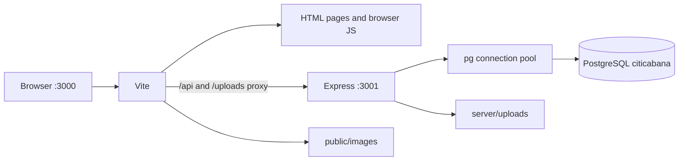
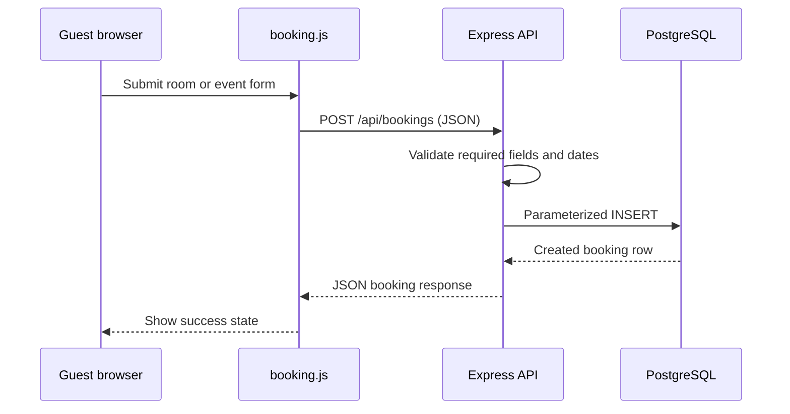
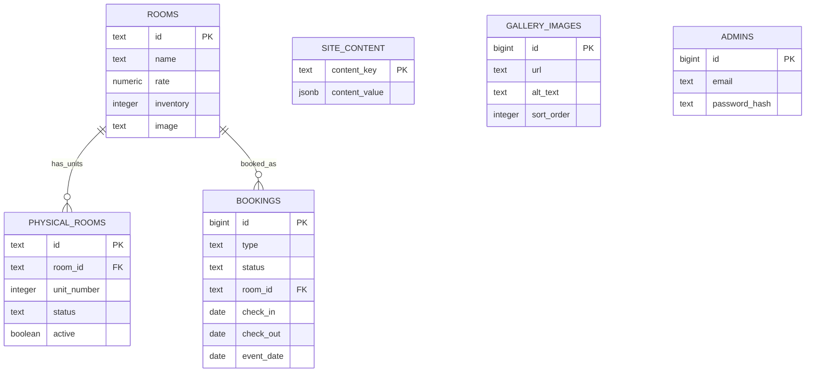

# Citi Cabana: Codebase Knowledge Chain

This guide follows the application in the order it runs. The central idea is:

```text
HTML/CSS/browser JavaScript -> Express API -> PostgreSQL
```

The browser never connects directly to PostgreSQL. Express is the middle layer: it receives browser requests, checks them, runs SQL, and returns JSON. Vite serves the frontend and forwards local API/image-upload requests to Express.

## 1. Start-up chain

The project has two local processes. PostgreSQL must also be running as a Windows service.



1. PostgreSQL runs the database named `citicabana`. Its connection settings come from the root `.env` file.
2. `npm run server` starts `server/server.js`. That file loads `.env`, creates a `pg` connection pool, registers the API, applies `server/schema.sql`, seeds missing default data, synchronizes physical-room rows, and then listens on `127.0.0.1:3001`.
3. `npm run dev` starts Vite from `vite.config.ts` on `127.0.0.1:3000`.
4. The browser opens `index.html` or one of the HTML files under `admin/`.
5. Vite serves files from the project and forwards `/api/...` and `/uploads/...` requests to Express.

The scripts and ports are defined in `package.json`; the Vite pages, loopback host, and proxies are defined in `vite.config.ts`. The database URL/password and session secret belong in `.env`, never in browser JavaScript.

## 2. Public website data flow

The root `index.html` contains the page structure and loads three classic browser scripts in this order:

```text
index.html
  -> js/rooms-data.js
  -> js/main.js
  -> js/booking.js
```

1. `js/main.js` waits for `DOMContentLoaded` and calls `loadCMSData()` from `js/rooms-data.js`.
2. `loadCMSData()` requests `GET /api/public-content`.
3. `vite.config.ts` forwards that request to Express.
4. `server/api.js` reads the public JSON content, room rows, and ordered gallery rows from PostgreSQL and returns one JSON response.
5. `js/rooms-data.js` applies text, link, accessibility-label, page-title, and background-image settings to elements marked with `data-content`, `data-content-href`, `data-content-aria-label`, or `data-content-background`.
6. `js/main.js` builds the room cards, event panel, gallery preview, room selector, lightbox, and booking summary from that data.

The room/event booking path is:



`js/booking.js` handles the two forms. Room bookings send a `roomId`; the API looks up the authoritative room name/rate record. Event bookings send their event details. Both are stored in `bookings` with status `Pending`.

## 3. Admin sign-in and page flow

Each admin HTML page loads `js/local-auth.js` first. That file checks `GET /api/admin/session`; unauthenticated visitors are sent to `admin/login.html`. The login page asks `GET /api/admin/setup-status` whether an admin exists:

- If no admin exists, the form calls `POST /api/admin/setup`. This is allowed only once.
- Otherwise, it calls `POST /api/admin/login`.
- Passwords are stored as bcrypt hashes in `admins`; successful sign-in creates a server-side session cookie.
- Admin API routes use `requireAdmin` to reject requests without that session.

After the auth script, operational pages load `js/local-admin.js`; `admin/cms.html` loads `js/local-cms.js` instead. The HTML supplies forms and element IDs; those scripts attach events, fetch JSON, and update the page.

| Page                        | HTML responsibility                                 | Browser controller                      |
| --------------------------- | --------------------------------------------------- | --------------------------------------- |
| `admin/login.html`          | Sign-in / one-time setup form                       | `js/local-auth.js`                      |
| `admin/dashboard.html`      | Pending count, today's activity, room-status totals | `js/local-auth.js`, `js/local-admin.js` |
| `admin/bookings.html`       | Booking filters and walk-in form                    | `js/local-auth.js`, `js/local-admin.js` |
| `admin/booking-detail.html` | Booking details, confirmation, status actions       | `js/local-auth.js`, `js/local-admin.js` |
| `admin/room-status.html`    | Physical-unit status board                          | `js/local-auth.js`, `js/local-admin.js` |
| `admin/reports.html`        | Date range and report summary                       | `js/local-auth.js`, `js/local-admin.js` |
| `admin/cms.html`            | Public content, room, and gallery editors           | `js/local-auth.js`, `js/local-cms.js`   |

## 4. Database relationships

`server/schema.sql` is the database structure. `server/database.js` runs it safely at server startup and seeds defaults only when the relevant data is missing.



- `site_content` stores the editable public page as one JSON object under the key `public`. `server/default-content.js` defines the default values and the set of keys the CMS may save.
- `rooms.inventory` is the count of sellable units for a room type.
- Each `physical_rooms` row is one operational unit, related to a room by `room_id` and numbered by `unit_number`. `(room_id, unit_number)` is unique. `active` hides units above current inventory without deleting their status; increasing inventory can reactivate them.
- `bookings.room_id` points to the room type. Deleting a room preserves its bookings but clears that foreign key (`ON DELETE SET NULL`). Deleting a room cascades its physical status units (`ON DELETE CASCADE`).
- `gallery_images` contains ordered gallery images and alternative text.
- `admins` contains email addresses and password hashes.

At startup, `initializeDatabase()` backfills the old fixed physical-room rows by matching their labels to room types, then calls `syncPhysicalRooms()`. The same sync function runs after a CMS room save. It creates missing units, deactivates excess units, updates labels, and preserves status values.

## 5. API route map

All routes below are mounted under `/api` in `server/api.js`.

| Routes                                                          | Purpose                                                             | Access                         |
| --------------------------------------------------------------- | ------------------------------------------------------------------- | ------------------------------ |
| `GET /public-content`                                           | Public text, rooms, and gallery                                     | Public                         |
| `GET /admin/setup-status`, `POST /admin/setup`                  | Check/create the first admin                                        | Setup is one-time              |
| `POST /admin/login`, `GET /admin/session`, `POST /admin/logout` | Local session lifecycle                                             | Login public; logout protected |
| `PUT /admin/content`                                            | Save editable public copy and image paths                           | Admin                          |
| `POST /admin/upload`                                            | Save an image under `server/uploads/`                               | Admin                          |
| `GET/POST/DELETE /admin/rooms`                                  | Read, create/update, and remove room types                          | Admin                          |
| `GET/POST/PATCH/DELETE /admin/gallery`                          | Read, add, reorder/edit alt text, and remove images                 | Admin                          |
| `POST /bookings`                                                | Create public room/event booking requests                           | Public                         |
| `GET/POST /admin/bookings`                                      | List/filter bookings and add confirmed walk-ins                     | Admin                          |
| `GET/PATCH /admin/bookings/:id`                                 | Read/update a booking and confirmation/downpayment                  | Admin                          |
| `GET /admin/dashboard`                                          | Pending count, today's arrivals/departures, live room-status totals | Admin                          |
| `GET /admin/reports`                                            | Confirmed booking/downpayment totals for date range                 | Admin                          |
| `GET /admin/room-status`, `PATCH /admin/room-status/:id`        | List/update active physical units                                   | Admin                          |

`server/api.js` owns request validation and SQL. SQL values are passed as parameters such as `$1`, not concatenated into query strings. `asyncRoute()` forwards asynchronous errors to the API error handler.

## 6. How to trace common changes

### Change public website copy

`admin/cms.html` renders the editor -> `js/local-cms.js` builds fields from `GET /api/public-content` -> save calls `PUT /api/admin/content` -> `server/api.js` validates keys against `defaultContent` -> PostgreSQL updates `site_content` -> next public page load applies those values in `js/rooms-data.js`.

### Change a room's inventory

CMS form -> `js/local-cms.js` sends `POST /api/admin/rooms` -> API upserts `rooms` -> `syncPhysicalRooms(pool, roomId)` reconciles `physical_rooms` -> `GET /api/admin/room-status` returns active units -> `js/local-admin.js` renders the status board and dashboard totals.

### See today's booking activity

Public form -> `POST /api/bookings` -> `bookings` row -> admin page requests `GET /api/admin/dashboard` -> SQL selects confirmed/checked-in room bookings where `check_in` or `check_out` is `CURRENT_DATE` -> `js/local-admin.js` renders counts and links to `admin/booking-detail.html?id=...`.

## 7. Source-file map

| File/folder                        | What it owns                                                                                              |
| ---------------------------------- | --------------------------------------------------------------------------------------------------------- |
| `index.html`                       | Public page and booking/gallery markup; `data-content` hooks connect markup to CMS text.                  |
| `css/style.css`                    | Public-site layout and styling.                                                                           |
| `js/rooms-data.js`                 | Public API load, content application, default fallback data.                                              |
| `js/main.js`                       | Public rendering, navigation, modal, gallery, lightbox, and price-summary interactions.                   |
| `js/booking.js`                    | Public room/event form submission to Express.                                                             |
| `admin/*.html`                     | Multi-page admin markup and form controls.                                                                |
| `css/admin.css`                    | Admin and login styles.                                                                                   |
| `js/local-auth.js`                 | Login/setup browser flow and protected-page session guard.                                                |
| `js/local-admin.js`                | Dashboard, bookings, booking detail, reports, and room-status UI.                                         |
| `js/local-cms.js`                  | Public content, room, and gallery CMS UI; image upload requests.                                          |
| `server/server.js`                 | Express bootstrap, `pg` pool, middleware, database initialization, listener.                              |
| `server/api.js`                    | REST routes, auth checks, validation, SQL operations, local uploads.                                      |
| `server/database.js`               | Schema application, safe default seeding, physical-unit migration/reconciliation.                         |
| `server/schema.sql`                | PostgreSQL tables, constraints, foreign keys, migrations/indexes.                                         |
| `server/default-content.js`        | Editable public text allowlist and initial room/gallery defaults.                                         |
| `public/images/`                   | Bundled default photos served by Vite.                                                                    |
| `server/uploads/`                  | CMS-uploaded images served by Express; ignored by Git.                                                    |
| `package.json`                     | Commands and installed packages.                                                                          |
| `vite.config.ts`                   | Multi-page Vite build and local API/upload proxies.                                                       |
| `.env.example` / `.env`            | Safe configuration template / private local credentials.                                                  |
| `README.md`                        | Setup and run instructions.                                                                               |
| `CHANGELOG.md`                     | Summary of the migration and its verification.                                                            |
| `tsconfig.json`, `metadata.json`   | TypeScript/template project settings and metadata; the current user-facing pages are vanilla HTML/CSS/JS. |
| `firestore.rules`, `storage.rules` | Legacy Firebase rules files; not loaded by the app.                                                       |

## 8. Learning order

Read these in order to build understanding without jumping between layers:

1. `package.json` and `README.md`: how to install and start the two processes.
2. `index.html`: how the browser page is structured and which scripts it loads.
3. `js/rooms-data.js`: how one API response fills the page with database content.
4. `js/main.js`: how data becomes room cards, events, gallery, and interactions.
5. `js/booking.js`: follow one form submission to `POST /api/bookings`.
6. `server/server.js`: understand how Express, PostgreSQL, middleware, and routes start.
7. `server/api.js`: follow the matching route from request validation to SQL.
8. `server/schema.sql`: see which tables and constraints store that data.
9. `server/database.js`: see how defaults and room-status units are reconciled.
10. `admin/login.html` + `js/local-auth.js`, then `admin/cms.html` + `js/local-cms.js`, then `admin/dashboard.html` + `js/local-admin.js`.

## 9. Commands and boundaries

```powershell
npm install
npm run server
npm run dev
npm run build
```

Keep the server and Vite commands in separate terminals. Open the site at `http://127.0.0.1:3000`; Express is at `http://127.0.0.1:3001`.

`server/server.js` also contains learning endpoints (`/api/hello`, `/api/hello/:name`, `/api/echo`, `/api/db-test`, and `/api/messages`). The `/api/messages` example expects a `messages` table created manually in pgAdmin; that practice table is intentionally not part of `server/schema.sql` or the booking/CMS model.

This setup is local-development-only: the server binds to loopback and Express uses an in-memory session store. It is not ready to expose to the public internet. Firebase rules remain as unused files, and Firebase-hosted records/admins are not imported automatically.
